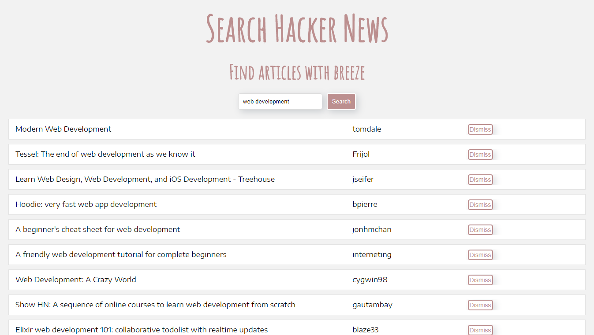

<h1 align="center">Search Hacker News</h1>
<h3 align="center">Find Articles with Breeze</h3>

Search Hacker News is the most simple way to find hundreds of latest articles on Hacker News network.

## Detail
Built using ReactJS, Search Hacker News is a single page application to find hundreds of articles against a specific term. You get to know about the title of article, author, link to the article and a dismiss button to filter a specific article from list.

## Design
This is the UI looks like:

## Demo
You can use Move Planner by clicking [here](https://shahzaibkhalid.github.io/search-hacker-news/).

## License
Move Planner is licensed under the [MIT License](https://github.com/shahzaibkhalid/search-hacker-news/blob/master/LICENSE.txt).

Copyright (c) 2017 Shahzaib Khalid